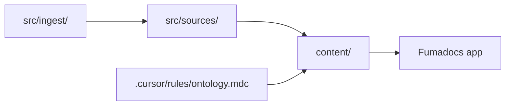

# Pare Down Kanon to a Solid Core

High-level review of all files in the repo, with keep/trim/remove decisions. **Revised per Dan's feedback (2026-06-14).**

---

## Context

Kanon is a **knowledge system template**, not an app. The core value is the Cursor-driven pipeline that turns raw material into a published Fumadocs site. The goal is to trim friction and over-engineering while **keeping differentiators** (offline/PWA, rich MDX, media) and **historical plans**.

**Related prior work:** [rebuild-cursor-files_2026-06-14.plan.md](rebuild-cursor-files_2026-06-14.plan.md)

---

## Decisions log (user corrections)

| Item                        | Original recommendation | **Decision**                                                                         |
| --------------------------- | ----------------------- | ------------------------------------------------------------------------------------ |
| Serwist / PWA               | Remove                  | **Keep** — offline-first stays a differentiator                                      |
| Twoslash                    | Remove                  | **Keep** — useful for TS code blocks; Fumadocs + Payload will add TypeScript content |
| react-player / VideoPlayer  | Remove                  | **Keep**                                                                             |
| placeholder dep             | Remove                  | **Remove**                                                                           |
| Link validation             | Remove entirely         | **Refactor & simplify** — keep the capability, lose the weight                       |
| `.cursor/plans/`            | Delete dev history      | **Keep all** — plans are valuable historical record                                  |
| `docs/README.md`            | Remove                  | **Remove** (folder can go if empty)                                                  |
| plan skill                  | Remove                  | **Keep** — prefer Kanon plan skill over Cursor's                                     |
| create-hook skill           | Remove                  | **Remove**                                                                           |
| ingest-force skill          | Remove                  | **Remove**                                                                           |
| plans.mdc rule              | Remove                  | **Keep** — pairs with plan skill; governs `.cursor/plans/` storage                   |
| Badge, AudioPlayer MDX      | Remove                  | **Keep for now**                                                                     |
| format-markdown Cursor hook | Remove or disable       | **Remove** — use Husky + git hooks for format/lint instead                           |

---

## CORE — Keep as-is

| Area                 | Paths                                                                                                                        | Notes                                    |
| -------------------- | ---------------------------------------------------------------------------------------------------------------------------- | ---------------------------------------- |
| Pipeline source dirs | `src/ingest/`, `src/sources/`, `src/references/`, `src/ontology/`                                                            | Empty skeleton with READMEs              |
| Fumadocs app + PWA   | `app/`, `lib/source.ts`, `source.config.ts`, Serwist stack                                                                   | Keep Webpack prod build for Serwist      |
| Twoslash             | `fumadocs-twoslash`, `source.config.ts`, `globals.css`, `mdx-components.tsx`                                                 | TS popup docs for dev/content            |
| Media MDX            | `AudioPlayer`, `VideoPlayer`, `Badge`, `Collapsible`, `CollapsibleCallout`                                                   | All kept for now                         |
| Content              | `content/index.mdx`, guides, `content/meta.json`, `content/manifest.json`                                                    | Guides may still be condensed (open)     |
| Agent core           | `AGENTS.md`, `.cursor/settings.json`, `.cursor/hooks.json`                                                                   |                                          |
| Pipeline skills      | `ingest`, `create-ontology`, `update-docs`                                                                                   | Core trio                                |
| Workflow skills      | `plan`, `commit`                                                                                                             | plan skill preferred over Cursor default |
| Safety hooks         | `after-file-edit.js`, `revert-ingest-if-edited.js`                                                                           | Pipeline only — no format hook           |
| Contract rules       | `folder-contract`, `ontology`, `sources`, `ingest`, `update-docs`, `media`, `plans`, `fumadocs-reference`, corrections rules |                                          |
| Plans history        | `.cursor/plans/` (all existing plans)                                                                                        | Do not delete                            |

---

## REMOVE

| Area                            | What                                                                                                                                 | Rationale                                                          |
| ------------------------------- | ------------------------------------------------------------------------------------------------------------------------------------ | ------------------------------------------------------------------ |
| **placeholder**                 | `"placeholder"` in `package.json`                                                                                                    | Unused                                                             |
| **create-hook skill**           | `.cursor/skills/create-hook/`                                                                                                        | Meta — extends template, not needed for users                      |
| **ingest-force skill**          | `.cursor/skills/ingest-force/`                                                                                                       | Edge case; can fold into ingest later if needed                    |
| **format-markdown hook**        | `.cursor/hooks/format-markdown.js` + `hooks.json` entry                                                                              | Replace with Husky for format/lint at commit time                  |
| **docs/README.md**              | `docs/README.md`                                                                                                                     | Only pointed at plans; remove file (and `docs/` if empty)          |
| **Heavy link-validation shell** | `scripts/README.md` (183-line doc), `scripts/install-git-hooks.js`, `scripts/git-hooks/pre-commit`, `prepare` script in package.json | Replaced by Husky; validation script itself refactored not deleted |

---

## REFACTOR / SIMPLIFY

### Link validation

Current state is heavy: custom enhanced validator, fix-links utility, config file, 183-line README, ad-hoc git hook installer.

**Target:** Lighter script(s) that still validate `content/` links, wired through Husky — not a separate hook-install pipeline.

- [ ] Audit what `validate-links.ts` actually needs vs nice-to-have (stats, categorization, fix-links)
- [ ] Collapse or slim config; drop `fix-links` if rarely used (or keep as optional script only)
- [ ] Replace `scripts/install-git-hooks.js` + `prepare` with **Husky** pre-commit
- [ ] Short README or note in main README instead of `scripts/README.md`

### Git hooks (Husky)

- [ ] Add Husky for pre-commit format/lint (Prettier on md/mdx, optionally link validation)
- [ ] Remove Cursor `format-markdown` hook entirely
- [ ] Do not run link validation on every file edit — only at commit (or CI)

### Content guides (still open)

| Option     | Notes                                     |
| ---------- | ----------------------------------------- |
| Keep as-is | Useful onboarding for non-technical users |
| Condense   | One shorter writing guide                 |
| Move       | Out of site nav into reference material   |

**Not decided yet** — leave guides unless/until Dan picks an option.

### README + SETUP

- [ ] Still worth merging or tightening — significant overlap
- [ ] Update references: keep PWA/Twoslash/media; drop create-hook, ingest-force, format-markdown hook

---

## Deliverables

### Phase 1 — Remove confirmed cruft

- [ ] Remove `placeholder` from `package.json`
- [ ] Delete `.cursor/skills/create-hook/`
- [ ] Delete `.cursor/skills/ingest-force/`
- [ ] Remove references to create-hook and ingest-force from README, SETUP, AGENTS.md, skills README
- [ ] Delete `.cursor/hooks/format-markdown.js`; remove from `hooks.json`
- [ ] Delete `docs/README.md` (and `docs/` if nothing else remains)
- [ ] Remove `scripts/install-git-hooks.js`, `scripts/git-hooks/pre-commit`, `prepare` script

### Phase 2 — Simplify link validation + add Husky

- [ ] Refactor `scripts/validate-links.ts` (and optionally `fix-links.ts`) to minimal useful surface
- [ ] Add Husky + pre-commit hook (Prettier; link validation if lightweight enough)
- [ ] Delete or drastically shorten `scripts/README.md`
- [ ] Update `package.json` scripts

### Phase 3 — Docs pass (optional / separate)

- [ ] Merge or tighten README + SETUP
- [ ] Decide on content guides (keep / condense / move)
- [ ] Sweep AGENTS.md, rules, skills for stale references

### Phase 4 — Verify

- [ ] `pnpm install && pnpm run dev` — site at `/docs`, offline badge works
- [ ] `pnpm run build` — Webpack build still succeeds (Serwist)
- [ ] `pnpm exec tsc --noEmit`
- [ ] Husky pre-commit runs as expected
- [ ] Pipeline skills (`ingest`, `create-ontology`, `update-docs`, `plan`) intact

---

## Acceptance Criteria

- [ ] Serwist, Twoslash, react-player, and all MDX media components remain
- [ ] `.cursor/plans/` history preserved; plan skill + plans.mdc kept
- [ ] create-hook, ingest-force, placeholder, format-markdown hook removed
- [ ] Link validation simplified; Husky replaces ad-hoc git hook installer
- [ ] No broken references in AGENTS.md, rules, or skills
- [ ] Template still builds and runs with existing PWA/Webpack setup

---

## Open decisions (still to edit)

1. **Content guides** — keep full guides vs condense vs move out of nav
2. **README + SETUP** — merge now vs later
3. **Link validation scope** — pre-commit only vs also CI; keep fix-links or drop
4. **ingest-force behavior** — document "re-run ingest on manifest" in ingest skill vs nothing

---

## Expected outcome

Leaner **tooling and meta-skills** without stripping product features:

| Keep                               | Remove / replace                 |
| ---------------------------------- | -------------------------------- |
| PWA / Serwist / offline            | placeholder dep                  |
| Twoslash                           | create-hook, ingest-force skills |
| react-player, Badge, AudioPlayer   | format-markdown Cursor hook      |
| All `.cursor/plans/`               | docs/README.md                   |
| plan skill + plans.mdc             | install-git-hooks.js + prepare   |
| Pipeline + commit skills           | Heavy scripts/README.md          |
| Simplified link validation + Husky | Ad-hoc pre-commit installer      |

---

## Progress Summary

| Phase                             | Status      |
| --------------------------------- | ----------- |
| Phase 1 — Remove confirmed cruft  | Not started |
| Phase 2 — Link validation + Husky | Not started |
| Phase 3 — Docs pass               | Not started |
| Phase 4 — Verify                  | Not started |
