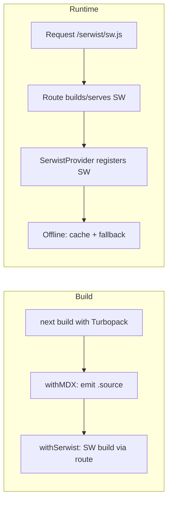

# Add PWA with Serwist (Turbopack) for Fumadocs offline support

## Goal

Make the Fumadocs site work offline for visitors (first visit caches the app and docs; subsequent visits work without network) using **Serwist** with **@serwist/turbopack**, so the build stays Turbopack-native and we avoid webpack-only PWA plugins like next-pwa.

## Why Serwist instead of next-pwa

- **next-pwa** is webpack-based; it does not integrate with Turbopack and would force webpack into the build or complicate the setup.
- **Serwist** is the modern PWA library (successor to Workbox-based tools) and has **first-class Turbopack support** via `@serwist/turbopack`: config wrapper, route handler to serve the built SW, and React provider. No webpack dependency.

## Current state

- [next.config.mjs](next.config.mjs): single wrapper `withMDX(config)` from Fumadocs MDX.
- [app/layout.tsx](app/layout.tsx): `RootProvider` only; no manifest or SW.
- No PWA manifest or icons. No Turbopack explicitly in scripts yet (can use `next dev --turbo` / Turbopack when we add Serwist).

## 1. Dependencies

- **Add (dev):** `@serwist/turbopack`, `esbuild`, `serwist`.
- **Do not add:** next-pwa or @serwist/next (webpack variant).

```bash
npm i -D @serwist/turbopack esbuild serwist
```

## 2. Next.js config: Serwist + Fumadocs MDX

Compose wrappers so Serwist wraps the rest (order: outer = applied last to the config object, so Serwist sees the full config):

- Use **`withSerwist`** from `@serwist/turbopack` (no options required for basic use).
- Keep **`withMDX`** from Fumadocs; pass the same config into both.

**Config shape:**

```js
import { withSerwist } from "@serwist/turbopack";
import { createMDX } from "fumadocs-mdx/next";

const withMDX = createMDX();
export default withSerwist(withMDX({
  reactStrictMode: true,
}));
```

No `output: 'export'` in this approach — see “Static export” below.

## 3. Serwist route handler (serves the SW)

With Turbopack, the service worker is **built and served by a route**, not written into `public/` at build time.

- **Add:** `app/serwist/[path]/route.ts` that calls `createSerwistRoute` from `@serwist/turbopack`.
- Options: `swSrc: "app/sw.ts"`, `additionalPrecacheEntries` for an offline fallback (e.g. `/{/~offline}`). Optional `revision` (e.g. from `git rev-parse HEAD`) for cache busting.
- This makes the SW available at **`/serwist/sw.js`** when the app is running (Node/server or serverless). The build stays simple; no webpack plugin.

Reference: [Serwist Turbopack quick guide](https://serwist.pages.dev/docs/next/turbo).

## 4. Service worker source file

- **Add:** `app/sw.ts` — Serwist worker that uses `defaultCache` from `@serwist/turbopack/worker`, `precacheEntries: self.__SW_MANIFEST`, and a document fallback to an offline page (e.g. `/~offline`).
- Include the usual triple-slash references for TypeScript (`lib="webworker"` etc.) and the `SerwistGlobalConfig` / `__SW_MANIFEST` declaration so the injection point type-checks.

## 5. Offline fallback page

- **Add:** a simple offline page (e.g. `app/(routes)/~offline/page.tsx` or a route that renders “You’re offline”) so the SW fallback has a document to serve. Register its URL in `additionalPrecacheEntries` in the Serwist route.

## 6. Web app manifest and icons

- **Use Next.js built-in:** `app/manifest.ts` (or `app/manifest.json`) returning name, short_name, description, start_url, display, theme_color, background_color, icons (at least 192 and 512). Next will serve it at `/manifest.webmanifest` (or similar).
- **Icons:** add `public/icon-192.png` and `public/icon-512.png` (or document that they must be added). Reference them in the manifest.

## 7. Root layout: manifest link, theme-color, SerwistProvider

- In [app/layout.tsx](app/layout.tsx):
  - **Metadata:** `metadata` (e.g. applicationName, title, description) and `viewport` with `themeColor` so the manifest and theme are consistent.
  - **SerwistProvider:** Wrap children with `<SerwistProvider swUrl="/serwist/sw.js">` from `@serwist/turbopack/react`. Use a small client wrapper (e.g. `app/serwist.ts` that re-exports `SerwistProvider`) so the layout can remain a server component and only the provider is client.

## 8. TypeScript and gitignore

- **tsconfig:** Add `"@serwist/next/typings"` (or Serwist Turbopack typings if documented) and `"webworker"` to `lib` if needed for SW types. Exclude generated SW output if any (e.g. `public/sw.js` if you ever generate it).
- **.gitignore:** Ignore `public/sw*`, `public/swe-worker*` if Serwist ever writes there; with Turbopack route-only setup, the route builds the SW in memory, so this may be optional.

## 9. Static export tradeoff

- **Serwist Turbopack** serves the SW from the **route** `/serwist/sw.js`. That requires a **running server** (Node or serverless). So we do **not** use `output: 'export'` in this plan — the app is deployed with a server so the route can respond.
- **If you need static export later** (e.g. host on a static CDN with no server): you’d need a separate build step that compiles `app/sw.ts` with esbuild (or Serwist’s build API) and writes `sw.js` into `public/`, then use `output: 'export'` and register `/sw.js` from the root. That would be an optional follow-up; this plan keeps the build simple and Turbopack-only.

## 10. Verification

- Run `npm run build` (with Turbopack if your Next version uses it for build).
- Run `npm run start` (or deploy to a server); open the site and visit a few docs pages.
- In DevTools → Application → Service Workers, confirm the SW is registered from `/serwist/sw.js`. Go offline and reload — previously visited pages should load from cache; navigations to uncached docs can show the offline fallback page.

## Files to add or touch

| Action | File |
|--------|------|
| Edit | [next.config.mjs](next.config.mjs) — add `withSerwist` from `@serwist/turbopack`, compose with `withMDX`. |
| Add | `app/serwist/[path]/route.ts` — `createSerwistRoute` with `swSrc: "app/sw.ts"`, offline fallback entry. |
| Add | `app/sw.ts` — Serwist worker with `defaultCache`, `__SW_MANIFEST`, document fallback. |
| Add | Offline page (e.g. `app/~offline/page.tsx` or equivalent) and list in `additionalPrecacheEntries`. |
| Add | `app/manifest.ts` or `app/manifest.json` — PWA metadata and icons. |
| Add | `public/icon-192.png`, `public/icon-512.png` (or document). |
| Add | `app/serwist.ts` — client re-export of `SerwistProvider` from `@serwist/turbopack/react`. |
| Edit | [app/layout.tsx](app/layout.tsx) — metadata, viewport, wrap with `SerwistProvider` (swUrl="/serwist/sw.js"). |
| Optional | [tsconfig.json](tsconfig.json) — Serwist typings and `webworker` lib. [.gitignore](.gitignore) — `public/sw*`. |

## Flow summary



## Risks / notes

- Deployment must support a Node/server or serverless runtime (Vercel, etc.); no pure static-only hosting for the SW unless you add a separate SW build-to-`public/` step.
- First load still requires network; offline works after the SW has cached pages and assets.
- If you add middleware, avoid blocking `/serwist/*`.
