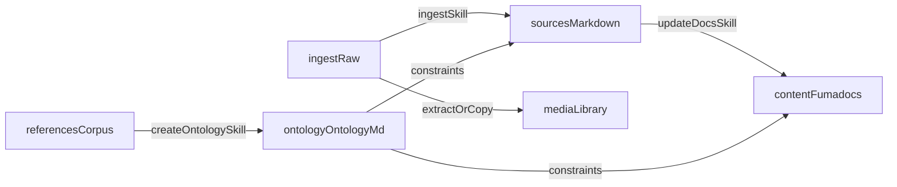

# Ingest → Sources → Docs (Ontology-driven) plan

**Note:** User-facing folders (ingest, sources, references, media, ontology) now live under **`src/`**.

## Goal state (new folder contract)

We’ll evolve the current v1 layout (raw `ingest/` → processed `content/`) into a two-stage system:

- `**ingest/**`: raw dropbox for *any* file type (append-only / immutable). Tracks ingestion status via a manifest.
- `**sources/*`*: the canonical, normalized “user-created” source corpus (Markdown only, with frontmatter). Organized into:
  - `sources/documents/`
  - `sources/chats/`
  - `sources/transcripts/`
  - `sources/media/` (Markdown metadata/notes about media)
- `**references/**`: non-user reference corpus (often PDFs) used to build/maintain the ontology.
- `**media/**`: shared, top-level media library (folders with meaningful names + per-item meta file) that *any* Markdown in `sources/` or `content/` can link to.
- `**ontology/*`*: schema only (no canonical entity data). Adds a single `ontology/ontology.md` as the “contract” the system follows.
- `**content/**`: Fumadocs output (derived/published knowledge base). Still served by the existing Next/Fumadocs app (`source.config.ts`, `app/docs`, etc.).

Because you chose **“commit everything”**, all of the above live in git; the rules will enforce immutability where desired (especially `ingest/` and `references/`).

## Data flow

## File formats and conventions

### `sources/**` frontmatter (standardized)

Create a single frontmatter contract used across `sources/documents|chats|transcripts|media`.

- **Required**:
  - `id`: stable ID (derived from date + slug)
  - `source_type`: `document | chat | transcript | media`
  - `weight`: numeric weight with your ordering baked in (proposed defaults):
    - documents: `1.0`
    - chats: `0.7`
    - transcripts: `0.5`
    - media: `0.4`
  - `title`
  - `created_at` (or `captured_at`) as ISO8601
  - `ingest_paths`: list of ingest file paths used to create/update this source
  - `ingest_hashes`: sha256 (or similar) for each ingest input (supports idempotency)
- **Common optional**:
  - `people`, `orgs`, `tags`, `language`, `confidence`, `needs_review`
  - `media_refs`: list of `media/...` paths when relevant

### `media/`** layout (your requested “top-level media folder”)

- **Naming**:
  - Folder per media item: `media/YYYY-MM-DD_short_descriptive_name/`
- **Contents**:
  - The binary asset(s): `asset.jpg`, `asset.mp4`, etc.
  - A metadata file next to it: `meta.md` (Markdown + frontmatter) describing:
    - origin/provenance (where it came from)
    - what it depicts
    - relevant entities/events
    - capture date, rights/license notes if needed
- **Usage**:
  - Any Markdown can link via relative paths to `media/...`.
  - For the website, we’ll decide one of these implementations:
    - **Option A (recommended)**: mirror `media/` into `public/media/` during `update-docs` so `/media/...` works in rendered docs.
    - **Option B**: configure a build step to copy `media/` → `public/media/`.

(Plan includes implementing one of these; details in “update-docs”.)

### Manifests (idempotency + re-ingest)

- `**ingest/manifest.json` (canonical)**: machine-readable status per ingest file
  - path, size, modified time, hash
  - ingestion status: `new | ingested | error`
  - produced outputs: `sources/*` IDs, `media/*` paths
  - timestamps and any error messages
- `**ingest/manifest.md` (human view)**: concise table generated/updated from the JSON (keeps your current UX, see existing `ingest/manifest.md`).
- `**content/manifest.json` (optional but recommended)**: tracks which `sources/`** hashes have been applied to `content/**` so hooks can detect “sources changed but docs not updated”.

## “Skills” (repeatable playbooks)

We’ll implement “skills” as repo-native playbooks (prompt/runbooks) plus Cursor rules that make them easy to invoke consistently.

- `**skills/ingest.md**`: ingest raw files into normalized `sources/**` + `media/**`, update manifests.
- `**skills/ingest-force.md**`: re-ingest all files regardless of manifest status (but still idempotent and safe).
  - Overwrite policy: never overwrite user-authored blocks inside `sources/**` (use protected sections / markers), but refresh normalized text/metadata sections.
- `**skills/create-ontology.md**`: read `references/**` + user prompt → produce/update `ontology/ontology.md` (+ optional templates under `ontology/templates/`).
- `**skills/update-docs.md**`: read `sources/**` + `ontology/ontology.md` → update Fumadocs in `content/**` + keep `content/meta.json` valid.

## Cursor rules (new set + migrations)

We’ll update/replace the current rules in `.cursor/rules/` (currently: `ingest.mdc`, `resources.mdc`, `ontology.mdc`, `corrections.mdc`). Proposed rule set:

- `**folder-contract.mdc` (alwaysApply: true)**
  - Declares the pipeline phases and allowed write targets per phase.
  - Makes “don’t write to ingest/references” and “docs live in content” unambiguous.
- `**ingest.mdc`** (update existing)
  - `ingest/**` is append-only; agent never edits files except manifests.
  - Output of ingest skill is **only** `sources/`**, `media/**`, and manifests.
- `**sources.mdc**`
  - Enforces Markdown-only, frontmatter schema, folder placement rules, weights.
  - Requires provenance pointers back to ingest + hashes.
- `**sources-corrections.mdc` (alwaysApply: true for ingest→sources work)**
  - Defines `sources/corrections.md` as the correction store applied during ingestion.
  - Examples: consistent speaker names, common transcription misspellings, canonical org names.
- `**references.mdc`**
  - Replaces `resources.mdc`; treat `references/**` as read-only.
  - For backward compatibility, we can also apply the same rule to `resources/**` and optionally migrate folder names.
- `**media.mdc**`
  - Defines `media/**` structure and `meta.md` contract.
  - Defines how Markdown should reference media (relative vs `/media/...`).
- `**ontology.mdc**` (update existing)
  - Declares `ontology/ontology.md` as the schema contract.
  - Sets expectations for stable identifiers, entity/event taxonomy, doc section mapping.
- `**update-docs.mdc**`
  - `content/**` is derived; update-docs is idempotent.
  - Requires provenance: `content/**` files must cite `sources/**` IDs (not raw ingest).
  - Describes how to preserve manual edits (protected sections) when regenerating.
- `**corrections-content.mdc**` (rename/split from current `corrections.mdc`)
  - Keep `.cursor/corrections.md` as the *global* “you corrected me” store applied when writing to `content/*`*.
  - Clarifies difference vs `sources/corrections.md` (ingest normalization).

## Hooks (make the workflow feel automatic)

We’ll extend the existing Cursor hooks (see `.cursor/hooks.json`, `.cursor/hooks/after-file-edit.js`, `.cursor/hooks/on-stop.js`).

- **Hook: afterFileEdit** (`.cursor/hooks/after-file-edit.js`)
  - If edit under `ingest/` (non-manifest): write `.cursor/next-step.md` reminder to run **ingest**.
  - If edit under `sources/`, `ontology/ontology.md`, or `references/`: reminder to run **update-docs** (and/or create-ontology if references changed).
  - If edit under `media/`: reminder to ensure `meta.md` exists + run update-docs if docs reference it.
- **Hook: stop** (`.cursor/hooks/on-stop.js`)
  - Warn if:
    - ingest files are still `new` (not present/ingested per manifest)
    - sources have changed since last docs update (using `content/manifest.json`)

## Migration steps (from current repo)

- **Keep the site working**: `content/` remains the Fumadocs source (`source.config.ts` already points to `content`).
- **Introduce new folders**: add `sources/`, `references/` (optionally migrate `resources/` → `references/`), `media/`, and `skills/`.
- **Upgrade manifests**: add `ingest/manifest.json` while retaining and updating `ingest/manifest.md`.
- **Update rules/hooks/docs**:
  - Update `[README.md](/Users/dan/repos/kanon/README.md)` and `[SETUP.md](/Users/dan/repos/kanon/SETUP.md)` to describe the new 2-stage pipeline.
  - Update `.cursor/rules/*.mdc` as above.
  - Update `.cursor/hooks/*` to reflect new reminders.

## Implementation details worth being explicit about

- **Idempotency keys**:
  - Ingest files tracked by hash; sources tracked by stable `id` + `ingest_hashes`.
- **Overwrite policy**:
  - Use protected sections in `sources/`** and `content/**` (e.g. “Notes” blocks) that regeneration never touches.
- **Docs structure**:
  - `ontology/ontology.md` defines what folders exist under `content/` (e.g. keep `docs/`, `entities/`, `events/`, add `stats/`, `narratives/`, etc.) and how update-docs populates them.

