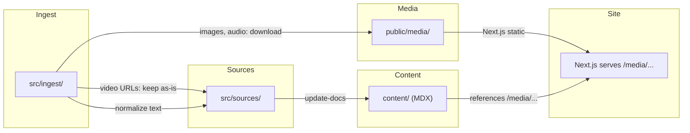

# Move Media to `public/` and Add Audio/Video Components

## Part 1: Relocate media from `src/media/` to `public/media/`

The canonical media library moves from `src/media/` to `public/media/`. Same folder structure (`YYYY-MM-DD_short_name/` with `meta.json` next to binaries), but no mirror step. Next.js serves `public/` at the site root, so files land at `/media/...` automatically.

### Media type handling during ingest

- **Images** (jpg, png, gif, webp, svg): Download to `public/media/YYYY-MM-DD_slug/`. Embed in sources and content as before.
- **Audio** (mp3, wav, ogg, m4a, aac, flac): Download to `public/media/YYYY-MM-DD_slug/`. Reference in sources; render with `<AudioPlayer>` in content MDX.
- **Video URLs** (YouTube, Vimeo, or any external video link): Do NOT download. Keep the URL as-is in the source. Render with `<VideoPlayer>` in content MDX. These will not work offline.

### Files to update (rules, skills, hooks, docs)

Each file below has references to `src/media/` that must change to `public/media/`, and the mirror step must be removed.

**Rules (`.cursor/rules/`):**

- `[.cursor/rules/media.mdc](.cursor/rules/media.mdc)` — Change canonical location from `src/media/` to `public/media/`. Remove mirror mention. Update globs from `src/media/`** to `public/media/**`. Add audio/video type handling.
- `[.cursor/rules/folder-contract.mdc](.cursor/rules/folder-contract.mdc)` — Replace `src/media/` entry with `public/media/`. Add it as a new top-level folder in the contract. Remove `src/media/` from the `src/` section.
- `[.cursor/rules/sources.mdc](.cursor/rules/sources.mdc)` — Change `media_refs` paths from `src/media/...` to `public/media/...`. Remove `src/sources/media/` subfolder (no longer a source type). Drop `media` from `source_type` enum.
- `[.cursor/rules/update-docs.mdc](.cursor/rules/update-docs.mdc)` — Remove "Media Mirroring" bullet. Update "Embedding images" to reference `public/media/...` directly. Add guidance for `<AudioPlayer>` and `<VideoPlayer>` in generated MDX.
- `[.cursor/rules/ingest.mdc](.cursor/rules/ingest.mdc)` — Change output target from `src/media/` to `public/media/`. Update manifest path references.

**Skills (`.cursor/skills/`):**

- `[.cursor/skills/ingest/SKILL.md](.cursor/skills/ingest/SKILL.md)` — Change media output from `src/media/` to `public/media/`. Remove `src/sources/media/` as an output subfolder. Add audio handling (download like images). Add video handling (keep URL, do not download). Update image URL handling section.
- `[.cursor/skills/ingest-force/SKILL.md](.cursor/skills/ingest-force/SKILL.md)` — Same changes as ingest skill.
- `[.cursor/skills/update-docs/SKILL.md](.cursor/skills/update-docs/SKILL.md)` — Remove mirror step from outputs and key behaviors. Update embedding guidance to use `<AudioPlayer>` and `<VideoPlayer>` components. Media paths are already `/media/...` in content (no change needed for web paths).

**Hooks (`.cursor/hooks/`):**

- `[.cursor/hooks/after-file-edit.js](.cursor/hooks/after-file-edit.js)` — Change `src/media/` path check (line 76) to `public/media/`. Update the reminder message to remove mirror language.

**Documentation:**

- `[README.md](README.md)` — Replace `src/media/` references with `public/media/`. Update workflow and folder descriptions.
- `[SETUP.md](SETUP.md)` — Update `src/media/` references.
- `[src/media/README.md](src/media/README.md)` — Move or replace with `public/media/README.md`.
- `[.cursor/memory.md](.cursor/memory.md)` — Update the "Media in ingest/update-docs" pattern.

**Also-applied rules (always-on, defined in system):**
The always-applied workspace rules in the system prompt reference `src/media/` extensively. These are sourced from the `.mdc` files listed above, so updating those files covers it.

---

## Part 2: Create `AudioPlayer` component

**Approach:** Build a custom, lightweight HTML5 `<audio>`-based component styled with Tailwind. No external dependency needed -- the HTML5 audio API is sufficient and keeps the bundle small. The component will be a client component (needs `useRef`, event handlers).

**File:** `components/mdx/audio-player.tsx`

**Features:**

- Play/pause button
- Seek bar (progress/scrubber)
- Current time / duration display
- Volume control (optional, can be minimal)
- Accessible: proper `aria-label`, keyboard-operable controls
- Accepts `src` (path like `/media/.../file.mp3`) and optional `title` prop
- Styled to match the Fumadocs theme (uses `fd-` prefixed CSS variables or Tailwind neutral palette)

**Usage in MDX:**

```mdx
<AudioPlayer src="/media/2025-06-01_interview/recording.mp3" title="Interview with Alice" />
```

---

## Part 3: Create `VideoPlayer` component

**Approach:** Use `react-player` (maintained by Mux, supports YouTube/Vimeo/external URLs, lazy-loadable). It's the most mature option for external video URLs and avoids reinventing iframe/embed logic. Import as `react-player/lazy` to minimize bundle impact.

**File:** `components/mdx/video-player.tsx`

**Features:**

- Wraps `react-player/lazy` for YouTube, Vimeo, and direct video URLs
- Responsive container (16:9 aspect ratio)
- When offline: overlay with "Video not available offline" message (reuse the `useSyncExternalStore` pattern from `[app/components/OfflineBadge.tsx](app/components/OfflineBadge.tsx)`)
- Accepts `url` and optional `title` prop
- Accessible: proper `title` on iframe/container

**Dependency:** `pnpm add react-player`

**Usage in MDX:**

```mdx
<VideoPlayer url="https://www.youtube.com/watch?v=abc123" title="Project demo" />
```

---

## Part 4: Register components in MDX

**File:** `[components/mdx/index.ts](components/mdx/index.ts)` — Export `AudioPlayer` and `VideoPlayer`.

**File:** `[mdx-components.tsx](mdx-components.tsx)` — They'll be available automatically via the `...customMdxComponents` spread (no additional wiring needed).

---

## Part 5: Cleanup

- Delete `src/media/` directory (currently only has `README.md`).
- Create `public/media/` directory with a `.gitkeep` (or the moved `README.md`).

---

## Summary of data flow after changes


